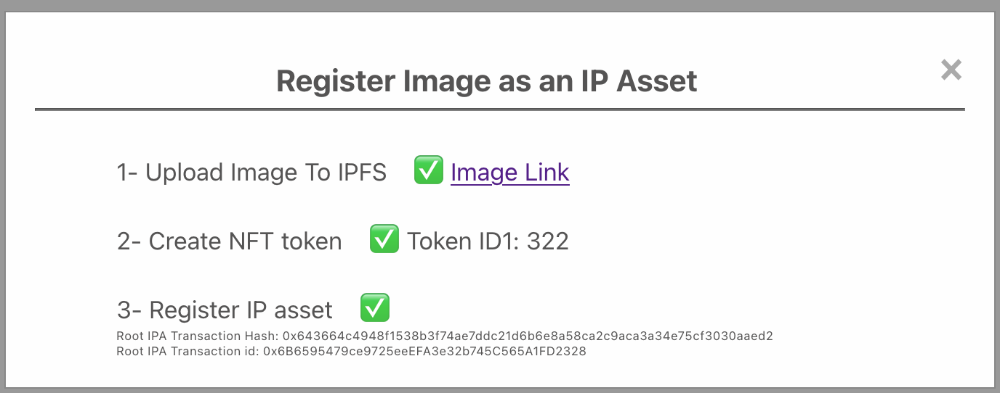

# Image Editor Project

Welcome to the Image Editor project, a powerful and user-friendly tool for creating and editing images. Built with React.js and the Fabric.js library, this application allows users to upload images or start with a blank canvas to add and manipulate various shapes, texts, and layers. With advanced features such as customizable colors, sizes, and a comprehensive layer system, users can design complex images effortlessly. Additionally, the application supports the registration of images as IP assets using blockchain technology, ensuring the preservation of intellectual property. Whether you are working on a desktop or a mobile device, the Image Editor offers a seamless and responsive experience tailored to your needs.

## Demo

You can see video of the project [here](https://www.loom.com/share/446edca425d443a88a90c8b52b9e1545), created with Loom.

You can test a live demo of the project [here](https://n-mazaheri.github.io/), created with GitHub Pages.

## Project Description

This is an image editor project based on React.js and the Fabric.js library for manipulating the canvas. It allows users to upload an image or start with a blank canvas and then add multiple shapes such as circles, ellipses, polygons, polylines, squares, rectangles, triangles, and texts. The font size, stroke size, fill color, stroke color of shapes, and colors of texts can be customized. Users can also change the size or rotate shapes by selecting them.

To better manage shapes and objects, the application employs a layer system. Each layer consists of a collection of objects, and users can create any number of layers. Only one layer is active at a time, and any object added by the user is automatically placed in the active layer. Users have the flexibility to select any layer and make it active. Within each layer, objects can be grouped, allowing users to resize or rotate all grouped objects simultaneously. Objects can also be ungrouped to resize or rotate a single object within the group. Additionally, layers can be made invisible or visible, and users can remove all objects from a layer if needed.

Users can save the resulting image while preserving the quality and file type of the initial image. To enhance usability for those working on smaller screens or with large-width images, the application resizes images to fill 80% of the window width. To maintain image quality, it employs an offscreen canvas that retains the original image size. All objects added by the user are resized and copied from the visible canvas to the offscreen canvas. This offscreen canvas is then used to save the resulting image with its original width, height, type, and quality. During the design process, if the user changes the window size (e.g., adjusts the browser width or rotates a mobile device), the application automatically resizes the visible canvas to 80% of the new window width. Users also have the option to clear the canvas and start with a new blank canvas.

Instead of uploading image from local computer, user can generate an image with the help of Stable Diffusion api and then use this image as initial image for editing in canvas.

Users can register an IP asset based on the image they design. To achieve this, the application uses the ThirdWeb library to connect to wallets, switch networks, upload images to IPFS, and generate a URL. It then uses the Story Protocol SDK to register the NFT with metadata about the image, such as its URL, as an IP asset. With the help of ThirdWeb's connect functionality, users can connect with various wallets, and even web2 users unfamiliar with wallets can connect via social logins. After connecting to their wallet, the application automatically switches the network to the desired network (in this case, the Ethereum test net Sepolia). If a user revisits the webpage, it will automatically reconnect to their wallet. If a user is already connected, they can register their IP asset. This process involves three steps:

1. Uploading the image to IPFS and creating a link.
2. Minting the NFT and creating the tokenId.
3. Registering the minted NFT and metadata of the file, such as the URL, in Story Protocol.
4. Generate initial image with artificial intelligence with the help of Stable Diffusion api

For testing purposes, users need to have a wallet, such as the MetaMask browser wallet.

## Setup and Installation Instructions

To set up the project, follow these steps:

1. Clone the repository: `git clone https://github.com/n-mazaheri/image-editor`
2. Navigate to the project directory: `cd image-editor`
3. Install dependencies: `npm install`
4. (optional) add a .env file to the project with any desired value for these two keys (They have default values in the code and code works without any .env)

   REACT_APP_NFT_ADDRESS => represent the contract address for minting nft
   REACT_APP_THIRDWEB_TOKEN=> represent Thirdweb token Id

5. Start the project: `npm start`

To build the project, run the following command, and use the build folder inside the image-editor directory:
`npm run build`

## User Guide

When opening the page, users start with a blank canvas that can be used to design an image. If desired, they can click the "Upload Image" button in the header to upload an image. After upload, the image is set as the background of the canvas, which automatically resizes to the minimum of the image width and 80% of the window width, with an appropriate height based on this width. The canvas size that users see is for display purposes, but when users save the resulting image, its width, height, and quality will match the original image. Users can save the resulting image by clicking "Save Image" in the header, which automatically downloads the image.

Users can draw any shape using the shapes toolbox in the side menu. The toolbox includes circles, ellipses, polygons, polylines, squares, rectangles, triangles, and text. When a user selects a shape, the button color changes to indicate selection, and the mouse cursor inside the canvas changes to a "+". Users can draw shapes with a mouse down and drag action. After drawing the shape, the button and cursor return to the unselected state. For polygons and polylines, users should mouse down, drag, and click for each line, then double-click to finish drawing the shape.

Users can select the fill color, stroke (border) color, and text color of shape objects using color pickers in the side menu. By clicking on each colorful rectangle, a color palette opens. Users can select any color they want and can set transparency to zero to remove color. Users can also change the colors of shapes after drawing by selecting them and changing the colors. In addition to color selection, users can select the width of the stroke (border) of shapes and the font size of texts using size pickers in the settings part of the size menu. These properties can be changed before drawing a shape or afterward by selecting the shape.

For managing shapes inside the canvas, the application includes a layer system, managed in the layers part of the size menu. Each layer is a collection of objects. Users can add layers by clicking the "+" button. The list of layers is visible in the side menu, with one layer active at a time. Users can change the active layer by clicking the layer number button, which changes color to green. When users draw a shape, it is automatically added to the active layer. Users can remove a layer by clicking the "-" button beside the layer, which removes all objects in the layer from the canvas. To make all objects in a layer visible or invisible, users can use the visible checkbox below each layer in the layer list. Users can group or ungroup objects in one layer using the group checkbox below each layer in the layer list. When objects are grouped, users can resize, rotate, and move all of them simultaneously. Selected images are always shown on top but will move to their correct order based on layers.

Users can change the order of layers by clicking the arrow down and arrow up buttons beside each layer in the layer list, indicating the order of objects in the canvas. Users can send back objects in a layer by clicking the up button or bring them to the front by clicking the down button. The arrangement of objects is based on their layer order: objects in the first layer are the furthest back, followed by objects in subsequent layers, with objects in the last layer being in front of all others.

Users can generate initial image in canvas with the help of artificial intelligence. For this ability, we use Stable Diffusion api. user can click on Generate Image(AI) in the header. It will open a modal like this. User can add a prompt describing image he want to create and then click on Generate Image button. Then, if he like generated image, can use this image in canvas by click on Load image in canvas button.

Users can save the resulting image as an IP asset to preserve the intellectual property of the image. To do this, users need to connect to their wallet by clicking the "Connect" button in the header. This shows a connect dialog that supports connection with over 300 desktop or mobile wallets. Users need to connect to Sepolia, an Ethereum testnet chain. After connecting, the "Connect" button changes to show the connected state, displaying the user's balance and address. Users can then click the "IP Asset" button in the header to make the image an IP asset. This starts the process and displays a dialog showing the process steps:

1. Upload the image to the IPFS file system and return the URI and link to the image.
2. Mint (create) an NFT for this image URI.
3. Register IP assets.

Each of these steps shows loading, success, or error states, with details about each successful step such as the image link, tokenId of the minted NFT, and Root IPA transaction address and IPA id.

## Code Structure

This is a React-based project using TypeScript. Source code has comprehensive comments. The most important libraries used in this project are:

1. **Redux Toolkit** for global state management.
2. **Fabric.js** for canvas manipulations.
3. **React Context** for saving `canvasRef` and all canvas manipulation functions. This is because `canvasRef` is a non-serializable object that cannot be saved inside the Redux state, so we use Context to share `canvasRef` information between different components.
4. **ThirdWeb library** for connecting to wallets and making contract calls.
5. **Story Protocol SDK** to create IP assets.
6. **React Color Picker**.

The project structure is as follows:

1. **components** folder containing all components used in the app. There are three main components: the header on top, the side menu, and the image viewer beside each other below the header. Each of these components has different subcomponents.
2. **redux** folder for the Redux store and Redux slices. There are two main slices: `canvasSlice` for saving all selected colors and sizes of the canvas, and `imageSlice` for keeping all information related to the layers and background image.
3. **contexts** folder for keeping contexts. In this project, there is only one context, `canvasContext`, which shares `canvasRef` among all components and also provides all needed functionality for manipulating the canvas and shape objects inside it.
4. **hooks** folder containing all hooks. The `useDrawShape` hook contains shape draw functionalities for different shapes such as mouse event handlers. The `useDimension` hook finds changes in the width and height of the window and causes re-rendering of any components that need to know the width. The `useNft` hook has all functions needed for registering an image as an IP asset.

In this project, we have separated the logic from the design of the components to ensure a clean and maintainable codebase. The core logic has been moved to custom hooks, context, and Redux reducers. This approach allows the UI components to focus solely on rendering and user interaction while the underlying functionality is handled efficiently in separate layers. By using hooks for encapsulating reusable logic, context for sharing non-serializable objects like canvas references, and Redux reducers for managing global state, the application remains modular, scalable, and easier to debug and enhance.

The three main components are the header, image viewer, and side menu. Each of these components has different subcomponents. For example, inside the header, the `imageUploader`, `imageSaver`, and `ipAsset` components are called. The `connectWallet` component from ThirdWeb is also called. Inside the side menu, the `settings`, `drawShapes`, and `layers` components are used. For drawing shapes, the `drawShape` component renders all shape buttons. The logic for drawing shapes is separate from this component and is inside the `useCanvas` component. In the settings part of the side menu, the `colorPicker` and `strokePicker` components are used multiple times for different colors and sizes. All setting information is kept inside the Redux `canvasSlice`. For layer management, the `layers` component renders the list of layers. All layer information is kept inside the Redux `imageSlice`.

In the canvas view part, the `canvasViewer` component is used. All canvas manipulation functions are inside the canvas contexts. It renders a blank canvas initially by calling the `clearCanvas` function inside `canvasContext`. Every time a user uploads an image, it updates the width and height of the existing canvas and sets its background image by calling the `createDataUrl` function inside `canvasContext`, saving all image information such as width, height, type, and imagePreview inside the Redux `canvasSlice`.
